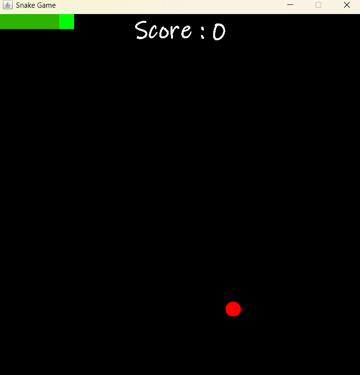
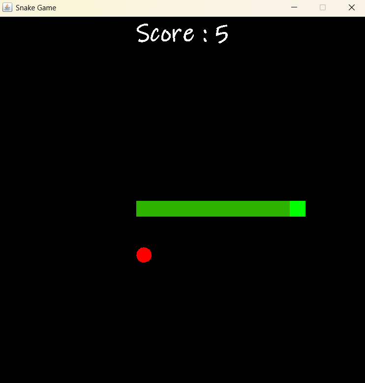
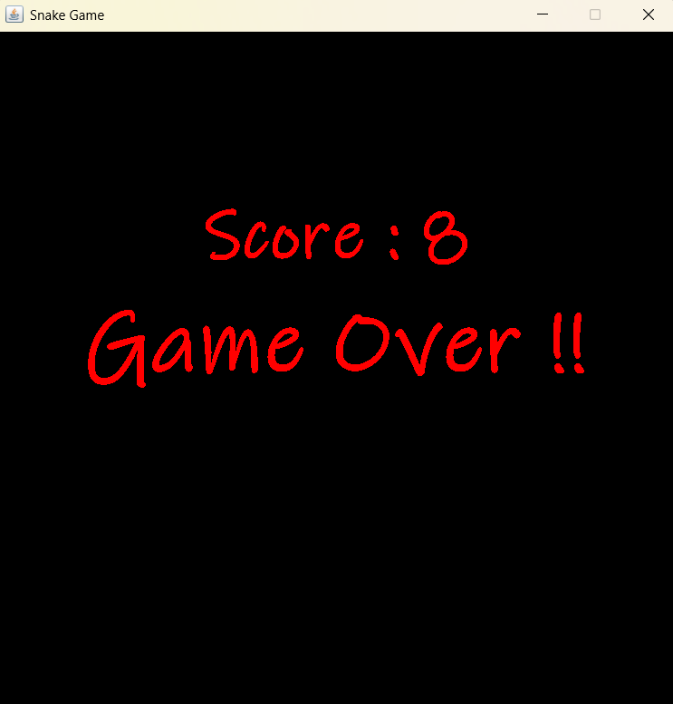

# 🐍 Snake Game
A Java implementation of the classic Snake Game built with the Swing framework. Navigate the snake, collect apples to increase your score, and survive as long as possible without colliding with the walls or yourself.
## 🎮 Demo

  

## 📸 Screenshots

  
  

## 📖 Overview

This project recreates the classic Snake Game using Java Swing. It demonstrates fundamental concepts of Java GUI development, including event-driven programming, object-oriented design, keyboard input handling, custom graphics rendering, collision detection, and game loop implementation using Swing's `Timer` API.

---

## ✨ Features

- Classic Snake gameplay with intuitive keyboard controls.
- Randomized apple generation.
- Real-time score tracking.
- Snake grows after consuming apples.
- Progressive difficulty with increasing game speed.
- Collision detection with walls and the snake's own body.
- Game Over screen displaying the final score.
- Built using Java Swing and AWT Graphics.

---

## 🎮 Gameplay

- Use the **Arrow Keys** to control the snake.
- Eat apples to increase your score and grow the snake.
- Avoid colliding with the walls or the snake's own body.
- Survive as long as possible and achieve the highest score.

---

## 🎯 Controls

| Key | Action |
|-----|--------|
| ⬆️ | Move Up |
| ⬇️ | Move Down |
| ⬅️ | Move Left |
| ➡️ | Move Right |

---

## 🛠️ Technologies Used

- Java
- Java Swing
- AWT Graphics
- Event Handling
- Object-Oriented Programming (OOP)

---

## 📚 Concepts Demonstrated

- Event-driven programming
- Object-oriented design
- Custom painting using `paintComponent()`
- Swing `Timer` for game loop implementation
- Keyboard event handling with `KeyAdapter`
- Collision detection
- Randomized object generation
- Graphics rendering using Java Swing

---

## 🙏 Acknowledgements

This project was developed as a learning exercise to strengthen Java GUI programming and game development fundamentals. Inspired by the classic Snake game.

## 📄 License

This project is licensed under the **MIT License**. See the [LICENSE](LICENSE) file for more information.
